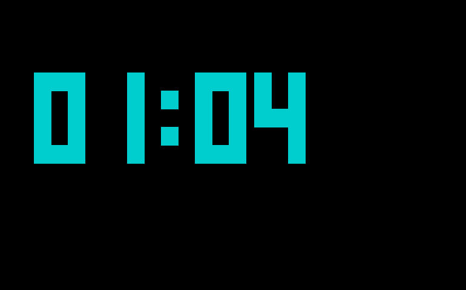
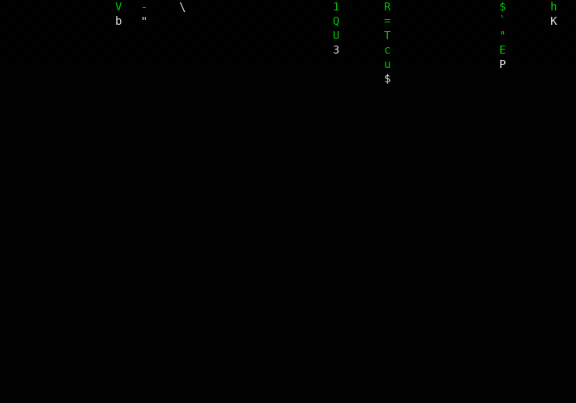

# ttysaver

Run any command as a fullscreen terminal screensaver. `ttysaver` takes over the
screen, renders a command's output, and drops you back to your shell the
moment you press a key.



`cmatrix` taken fullscreen. Any key drops you back to the shell:



## Usage

```
ttysaver [OPTIONS] [--] <command> [args...]
```

| Option | Meaning |
|--------|---------|
| `--size <WxH>` | Virtual terminal size used by the command. Defaults to filling the terminal. |
| `--zoom <N \| XxY>` | Nearest-neighbour scale. `4` = 4× both axes; `4x2` = 4 wide, 2 tall. Colour is preserved. Default 1. |
| `--bounce` | Bounce the output around the terminal, DVD-logo style. |
| `--center` | Center the output in the terminal. |
| `--speed <N>` | Bounce speed in cells/second (fractions allowed, e.g. `0.5`, `8`, `30`). Default 8. |
| `--fps <N>` | Frame rate / render smoothness (1–240). Default 30. |
| `-h`, `--help` | Help. Use `-H` / `--help-all` for the advanced options. |

Put `--` before the command when it has its own flags, so they aren't read as
ttysaver options.

### Advanced (`-H`)

| Option | Meaning |
|--------|---------|
| `--no-crop` | When centering or bouncing, use the whole virtual screen as the box instead of cropping to content. |
| `--exit-on-eof` | Exit as soon as the command exits, instead of holding its last frame until a keypress. |

## Config

Set your own defaults in `~/.config/ttysaver/config.toml` (or
`$XDG_CONFIG_HOME/ttysaver/config.toml`). Precedence is built-in < config < CLI
flag, so a flag always wins for that run.

```toml
# Supported keys under [defaults]: speed, fps, zoom.
[defaults]
speed = 2      # bounce speed in cells/second (fractions ok)
# fps  = 30    # render smoothness (1-240)
# zoom = 1     # "4" = 4x both axes, or "4x2" = 4 wide x 2 tall
```

A missing file or a bad value is ignored without complaint. A screensaver
shouldn't refuse to start over a config typo.

## Examples

```sh
ttysaver htop                              # fullscreen; any key exits
ttysaver --zoom 6 tty-clock                # giant clock, colour intact
ttysaver --center tty-clock                # centered clock (no --size needed)
ttysaver --bounce tty-clock                # bounce the clock itself
ttysaver --bounce hostname                 # bounce a one-shot command's output
ttysaver --zoom 2 --bounce cmatrix         # scaled + bouncing
ttysaver -- sh -c 'while :; do date; sleep 1; done'
```

Pairs nicely with tmux: point `lock-command` at it (with `lock-after-time`) so
it starts when you go idle. It's a screensaver, not a lock, so any key dismisses
it.

## Build

```sh
cargo build --release
# binary: target/release/ttysaver
```

Built on `portable-pty` (spawn the child in a sized pty), `vt100` (parse its
output into a grid of colored cells), and `crossterm` (raw mode, alt-screen, key
events).

## Notes / limits

- Tuned for ASCII and box-art TUIs (clocks, `htop`, `cmatrix`). Wide and CJK
  glyphs can drift a column under zoom.
- The child is killed on exit, and the terminal is always restored, even on a
  panic.
</content>
</invoke>
